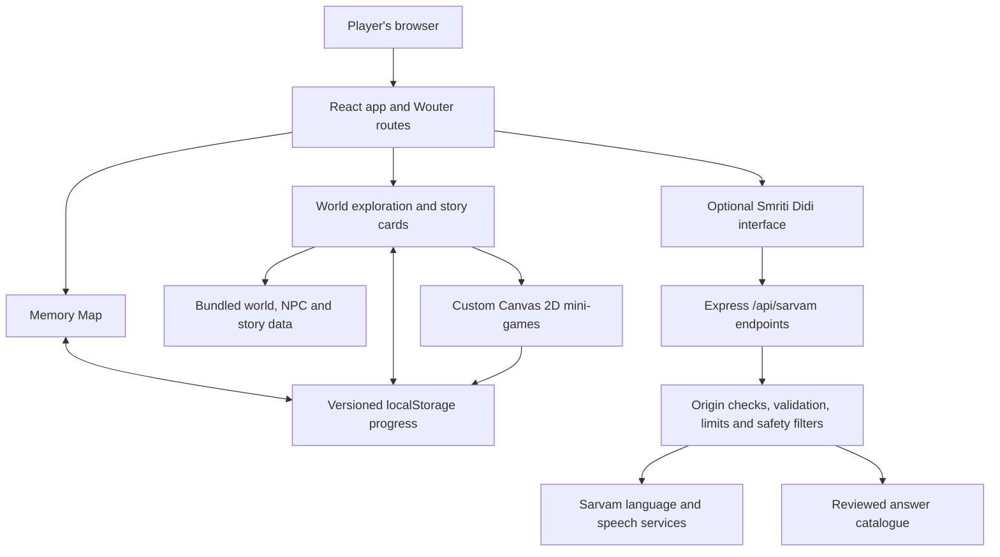

<div align="center">

# BharatVerse

### Discover, Play and Restore India's Heritage

A browser-based heritage learning game for school students, built for Smart India Hackathon 2026.


**Team Beyonders · SIH26208 · Toys & Games · Software**

</div>

## About the project

BharatVerse helps children explore Indian history, art, festivals and traditional sports through stories and playable activities. Instead of only reading about a place or tradition, students meet characters, solve related challenges and restore lost memories on a heritage map.

A Time Rift has scattered India's memories. The player joins Aru, a curious student, and Smriti, the spirit of memory, to recover them. The adventure follows three steps:

1. **Discover** a place, character or cultural story.
2. **Play** an activity connected to what you have learned.
3. **Restore** a memory and continue exploring the map.

This is a working prototype, not a finished curriculum product. Some discoveries and endings are still in development; the AI Guide is a controlled preview feature.

## Contents

- [Current experience](#current-experience)
- [Screenshots](#screenshots)
- [Technology](#technology)
- [Architecture](#architecture)
- [Getting started](#getting-started)
- [Optional API and AI Guide](#optional-api-and-ai-guide)
- [Checks and tests](#checks-and-tests)
- [Project structure](#project-structure)
- [Limitations and roadmap](#limitations-and-roadmap)
- [Contributing and content review](#contributing-and-content-review)

## Current experience

The prototype contains **five registered heritage worlds, 13 story NPCs in Sindhu Ghati, and six playable mini-games**. Registered worlds are not all equally complete.

| World | Theme | Playable activities |
| --- | --- | --- |
| Sindhu Ghati | Indus Valley city life and planning | **Naali Paheli** — drainage puzzle; **Sheher Banao** — city builder |
| Magadha Kaal | Ancient Magadha and learning | **Pothi Khoj** |
| Kala Bhoomi | Traditional arts and patterns | **Rangoli Rang** |
| Apni Parampara | Festivals and traditions | **Diye Jalao** |
| Khel Maidan | Indigenous sports | **Kho-Kho Daud** |

Other implemented elements include:

- An illustrated Memory Map with restoration progress and region navigation.
- Building hotspots, story cards and character dialogue.
- Sindhu Ghati walk-mode infrastructure; other regions use pan-and-click exploration.
- Custom Canvas 2D mini-games with progress and completion handling.
- Rift transitions and reduced-motion handling.
- Keyboard and touch controls where supported by each activity.
- Browser speech narration, plus optional server-backed guide and speech features.
- Versioned, browser-local progress saves.
- Configuration validation and headless game-solvability checks.

## Screenshots

| Village entrance | Granary | Bazaar |
| --- | --- | --- |
|  |  |  |

These screenshots illustrate the map and village artwork; individual screens may evolve as the prototype develops.

## Technology

| Area | Implementation |
| --- | --- |
| Frontend | React 19, TypeScript, Vite 7 |
| Styling | Tailwind CSS 4, CSS, reusable UI components |
| Routing | Wouter |
| Game rendering | Custom HTML5 Canvas 2D scenes and React overlays |
| Content | Bundled JSON and TypeScript registries |
| Player progress | Browser `localStorage` |
| API | Node.js, Express 5, request validation |
| Optional language services | Sarvam API through server-side endpoints |
| Browser audio | Web Speech API and MediaRecorder |
| Validation | TypeScript, headless scene checks, Playwright |
| Workspace | pnpm monorepo |

**Phaser is not used.** The core game does not require a database. Database-related workspace scaffolding exists, but player progress is not stored in PostgreSQL or synced to a server.

## Architecture



### Rendering and content

The interface uses a fixed logical stage that scales to the viewport. World art forms the backdrop, with interactive hotspots placed in world coordinates. Mini-games use a shared scene framework rather than a third-party game engine.

World definitions, building positions, NPC dialogue and unlock rules are data-driven. New content still needs validation, appropriate artwork and testing; registering a world alone does not make all its activities complete.

### Progress

The browser saves versioned player-progress deltas instead of copying entire world definitions. Unlock states are derived from current content and completion data.

Progress belongs to the browser and device where it was created. Clearing site data can erase it; cross-device accounts and cloud saves are not implemented.

## Getting started

### Requirements

- **Node.js 20.19+ or 22.12+** (compatible with Vite 7).
- **pnpm 10**; the current workspace has been used with pnpm 10.26.
- A modern browser. Landscape or desktop viewing is recommended.
- Repository access if the GitHub repository is private.

Use pnpm, not npm or Yarn: workspace dependencies and the lockfile rely on it.

### Run the core game locally

```bash
git clone https://github.com/adityarajgupta154/bharatverse-game.git
cd bharatverse-game
pnpm install --frozen-lockfile

PORT=5173 BASE_PATH=/ pnpm --filter @workspace/bharatverse run dev
```

Open `http://localhost:5173`.

The command above uses POSIX shell syntax. In PowerShell, set `$env:PORT="5173"` and `$env:BASE_PATH="/"` before running the pnpm command.

The core game can run without the API server or a Sarvam key. Server-backed guide, speech and transcription features require the optional API setup below.

### Build and preview the game

```bash
pnpm --filter @workspace/bharatverse run build
PORT=5173 BASE_PATH=/ pnpm --filter @workspace/bharatverse run serve
```

Build output: `artifacts/bharatverse/dist/public`.

Builds default to the `/` base path. For a subpath deployment, set `BASE_PATH` during the build and configure the host to serve that path. Static hosting needs an SPA fallback to `index.html` for direct navigation to game routes.

## Optional API and AI Guide

Smriti Didi is a **controlled prototype**, not an unrestricted chatbot or a production-complete child-safety system. Guide answers are selected from reviewed content rather than displaying arbitrary model-generated prose.

The API exposes guide, speech and transcription endpoints under `/api/sarvam`. It includes origin checks, input validation, rate and concurrency limits, topic restrictions and personal-information filters.

### Server configuration

| Variable | Purpose |
| --- | --- |
| `PORT` | Required API listening port; for example, `5000` locally |
| `APP_ORIGIN` | Browser application's allowed origin; configure it to match the actual frontend |
| `SARVAM_API_KEY` | Server-only provider credential for optional language and speech services |
| `SARVAM_AI_PUBLIC` | Public-production opt-in; leave unset while public safety work is incomplete |
| `NODE_ENV` | Runtime environment; production AI endpoints are disabled by default |

Set credentials through your environment's secret manager. Never put them in the README, client code, Git remote URL or committed environment files. The scripts do not automatically load an arbitrary `.env` file.

Example API command after configuring any required secrets:

```bash
PORT=5000 APP_ORIGIN=http://localhost:5173 pnpm --filter @workspace/api-server run dev
```

**Local routing caveat:** starting both processes is not enough to connect the guide. The frontend makes relative `/api/...` requests, and the checked-in Vite configuration does not provide a local API proxy. Configure a same-origin reverse proxy or add a local Vite proxy for `/api` to the API port, and align `APP_ORIGIN` with the browser origin. Do not hardcode backend hostnames into browser components.

Voice transcription sends submitted audio to the external speech provider. Do not use children's personal recordings for public testing without an appropriate consent and privacy process.

## Checks and tests

Run from the repository root:

```bash
# Type-check shared libraries and artifacts
pnpm run typecheck

# Validate world data, all six games, unlock rules and village simulation
pnpm --filter @workspace/bharatverse run verify:games

# Build just the game
pnpm --filter @workspace/bharatverse run build

# Browser tests
pnpm --filter @workspace/bharatverse run test:e2e
```

Playwright's pre-test script installs Chromium. Linux environments may also require browser system libraries. The test configuration starts its own frontend server; ensure its port is free.

`pnpm run build` at the root additionally type-checks and builds all workspace packages that provide a build script, including companion artifacts. It is broader than building the game alone.

## Project structure

```text
artifacts/
  bharatverse/             Main game
    src/
      components/          Map, world, guide and shared UI
      game/                State, content, worlds and mini-game scenes
      pages/               Routed screens
    scripts/               Headless validation and simulation
    tests/                 Playwright coverage
  api-server/              Optional Express guide and speech API
  bharatverse-sih-deck/     SIH presentation artifact
  mockup-sandbox/           Isolated design/component previews
lib/                       Shared schemas, API clients and workspace libraries
docs/screenshots/          README images
attached_assets/           Reference artwork, source documents and uploads
scripts/                   Workspace tooling
```

## Limitations and roadmap

- Some newer regional discovery cards still show “coming soon.”
- Sindhu Ghati's final mystery activity is not yet a complete playable finale.
- Walk-mode support is not a finished, consistent experience across every region.
- The layout is landscape-first; portrait use can show a rotate-device prompt.
- Keyboard and accessibility improvements remain ongoing, not fully certified.
- Saves are local only, with no account system or cross-device recovery.
- The AI Guide still needs public-release safety and privacy work. Keep production AI disabled until that work is reviewed.
- Heritage content needs claim-level source citations and educator review before presenting it as a validated curriculum resource.
- Learning outcomes have not yet been established through classroom studies.

Future directions include more regional content, language support, teacher feedback and classroom pilots. These are plans, not claims about the current build.

## Contributing and content review

1. Keep changes focused and follow the existing world and scene structures.
2. For historical claims, provide traceable references from sources such as NCERT, ASI, UNESCO or relevant scholarship.
3. Check content for age-appropriateness and respectful representation.
4. Run type checks and the relevant game validators.
5. Include screenshots for interface changes and document any new configuration.

Do not commit API keys, private recordings or personal student data. Avoid broad dependency or architecture changes unrelated to the feature being worked on.

### Code and asset permissions

The root package metadata declares MIT, but a standalone repository license file has not yet been included. Artwork, uploaded references, logos and third-party material may have separate rights. Do not assume the code's package metadata grants permission to redistribute every asset.