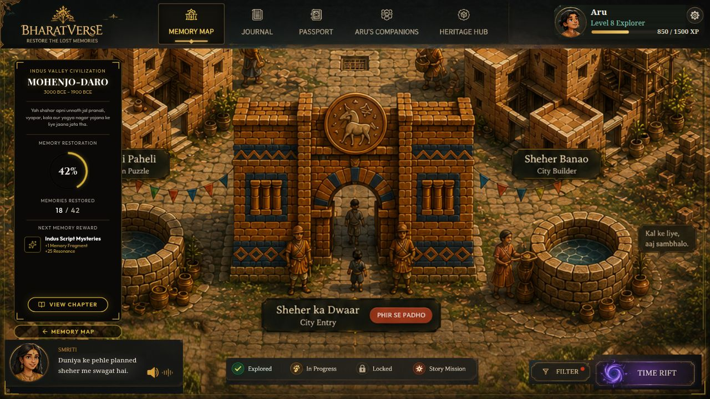
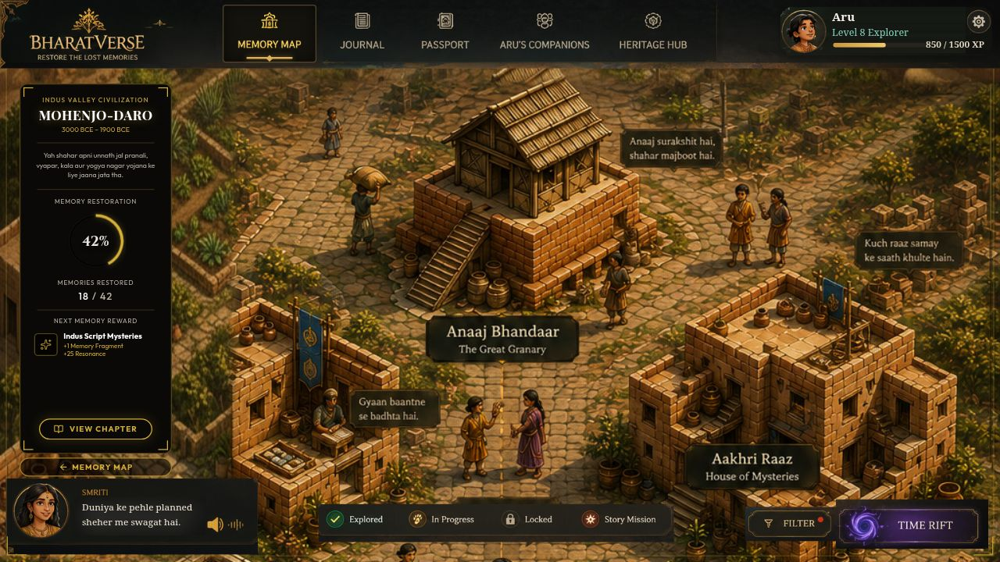
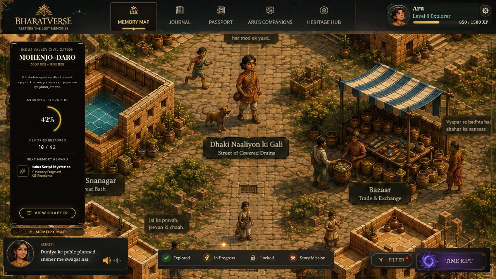

# BharatVerse — Restore the Lost Memories

An interactive Indian-heritage exploration game for school students. A mysterious **Time Rift** has stolen India's memories — players travel with **Aru** (a curious student) and **Smriti** (the spirit of memory) into painted historical worlds, restore forgotten places, and earn back the lost chapters of history.

> Wonder, not lecture: every fact is discovered by walking through a living world, talking to villagers, and solving puzzles — never by reading a wall of text.

| Village entrance | The Great Granary | Bazaar street |
| --- | --- | --- |
|  |  |  |

---

## How the game works

### Layer 1 — The Memory Map (hub)

The home screen is a hand-painted map of India with **five era nodes** (Sindhu Ghati / Indus Valley, and more to come). Each node shows its **Memory Restoration %**, memories found, and the next reward. A pinned info panel, Smriti's dialogue bar, a legend, and era filters complete the HUD. Restoring a node fires a golden pulse on the map — visible proof that a piece of history is back.

### Layer 2 — Node worlds (the Village layer)

Entering a node through the rift lands you **inside** that era: a tall painted village rendered 1:1 that you pan vertically (wheel, drag, arrow keys). Everything in the painting is real gameplay:

- **Buildings are story beats.** Each labeled building (The Great Bath, The Great Granary, Street of Covered Drains, Bazaar, Drain Puzzle, City Builder…) is a hotspot that opens its stage: explore panels, minigames, or the city-builder.
- **Free-roam with one gate.** Players visit buildings in any order. Only **Aakhri Raaz (House of Mysteries)** — the node's climax — stays locked until the prerequisite buildings are done. Completing the climax restores the whole region on the Memory Map.
- **Living NPCs.** Villagers baked into the painting speak when hovered/tapped (dialogue bubbles in Hindi), and ambient villagers murmur on their own in a staggered cycle, so the streets feel alive without covering the art.
- **Rift transitions.** Entering/leaving a world plays a purple rift veil that blooms from the exact gate you clicked; `prefers-reduced-motion` users get instant navigation instead.

### Progress & persistence

Progress (restoration %, memories, completed buildings) persists in `localStorage` under a **versioned schema** — only player *deltas* are saved, never whole config objects, so content updates can't corrupt old saves.

---

## Architecture

### Monorepo layout (pnpm workspaces)

```
├── artifacts/
│   ├── bharatverse/        # The game — React + Vite web app (main artifact)
│   ├── api-server/         # Express API server (future backend features)
│   └── mockup-sandbox/     # Dev-only isolated component preview server
├── attached_assets/        # PRDs + reference paintings (design source of truth)
├── docs/screenshots/       # README imagery
└── replit.md               # Working agreements & architecture notes
```

**Stack:** React 18 + TypeScript + Vite · wouter (routing) · Tailwind CSS · TanStack Query · Express.

### The stage system (art-first rendering)

The entire game renders on a **fixed 1024×592 logical stage** that scales uniformly to the viewport (`StageLayout`, constants in `src/lib/stage.ts`). Reference paintings are shown 1:1 in stage pixels; interactive elements are **invisible hotspots positioned in world coordinates** on top of the art. This is what keeps the game pixel-faithful to the reference illustrations.

```
src/ (inside artifacts/bharatverse)
├── components/
│   ├── hub/          # Memory Map: MapStage, InfoPanel, SmritiDialogue,
│   │                 #   LegendBar, RightControls, StageLayout, TopNav
│   ├── world/        # Village layer: NodeWorldScreen, NodeBuilding,
│   │                 #   BuildingCard, NpcLayer, DialogueBubble, RiftTransition
│   └── ui/           # shadcn/ui primitives
├── game/
│   ├── store.tsx     # Global state + versioned localStorage persistence
│   ├── nodes.ts      # Hub node data (eras, positions, restoration state)
│   ├── world-types.ts# WorldConfig / WorldBuilding / WorldNpc schemas
│   └── worlds/
│       ├── index.ts  # World registry + dev-time config validator + how-to guide
│       └── sindhu-ghati/
│           ├── buildings.json   # 8 buildings: type, position, gating, copy
│           └── npcs.json        # 13 NPCs: category, position, dialogue lines
├── lib/              # stage constants, reduced-motion hook, utils
└── pages/            # Hub, Journal, Passport, Companions, Heritage, …
```

### The world engine (config-driven worlds)

`NodeWorldScreen` is a **generic template**: it receives a `nodeId` (route `/world/:nodeId`) and renders that node's world entirely from the registry. **Adding a new era world requires zero screen-code changes:**

1. Drop the world painting in `src/assets/images/` (width 1024 world-px; any height — the screen pans).
2. Create `src/game/worlds/<node-id>/buildings.json` and `npcs.json` following `world-types.ts`.
3. Add one `defineWorld({...})` entry to the registry in `src/game/worlds/index.ts`.

Pan/drag/keyboard input, building gating, NPC dialogue, rift transitions, and climax→map-restore all come from the engine. A **dev-only validator** fails loudly at load if a config has mistakes (out-of-bounds coordinates, dangling `unlocksAfter` ids, duplicate ids, missing climax, registry key ≠ nodeId…), so authoring errors can never ship as silent dead hotspots.

**Building states** are derived, never stored: `completed → explored`, else `unmet unlocksAfter → locked`, else the authored initial state. Completing a world's single `climax` building fires the hub's region-restore.

### The NPC engine

Bubble visibility is **source-aware**: hover, keyboard focus, tap-pin, and the ambient auto-speak cycle each own an independent flag, and the bubble shows while *any* is active — so the ambient timer can never dismiss a bubble the player is reading. Details that matter:

- Ambient villagers speak one at a time (stagger > bubble open duration) — a murmur, not a chorus.
- Keyboard accessible: hotspots are focusable buttons with stable Hindi `aria-label`s; transient dialogue renders in a `role="status"` live region; `:focus-visible` gating stops mouse clicks from sticking bubbles open.
- Bubbles clamp to the canvas near edges and flip below the speaker near the top of the view (so the nav bar never covers them).

### Rift transitions

A `sessionStorage` handshake (`bv-rift-veil`, destination + expiry) coordinates the two halves of a transition across navigation. Veils render through a **portal to `document.body`** — the scaled stage creates a stacking context that would otherwise trap any overlay beneath the fixed nav.

---

## Running locally

Requirements: **Node 20+** and **pnpm**.

```bash
pnpm install

# The game (Vite dev server; binds to $PORT, defaults to Vite's port locally)
pnpm --filter @workspace/bharatverse run dev

# Optional: API server & component sandbox
pnpm --filter @workspace/api-server run dev
pnpm --filter @workspace/mockup-sandbox run dev

# Typecheck everything
pnpm run typecheck
```

### Dev helpers

| Helper | What it does |
| --- | --- |
| `/world/sindhu-ghati?debug` | Shows hotspot outlines + NPC ids + dev-complete buttons on building cards |
| `/world/sindhu-ghati?at=472` | Opens the world pre-scrolled to world-Y 472 |

---

## Design principles

1. **Pixel-parity with the reference art.** The illustrations are the spec: UI is either baked into the painting or measured against it.
2. **Config over code.** Story content lives in JSON; engines are generic. New eras are data, not features.
3. **Explicit failure.** Config validators throw with aggregated, actionable messages in dev; saves are schema-versioned.
4. **Accessible by default.** Full keyboard paths, reduced-motion fallbacks for every animation, screen-reader-safe labels.

## Roadmap

- Magadha and the remaining era worlds (the engine is ready — each is art + two JSON files).
- Node unlock-chain progression on the Memory Map.
- The minigames behind each building's stage (Drain Puzzle, City Builder…).
- Audio: Smriti's voice lines and village ambience.

---

Built on [Replit](https://replit.com). Reference paintings and PRDs live in `attached_assets/`.
