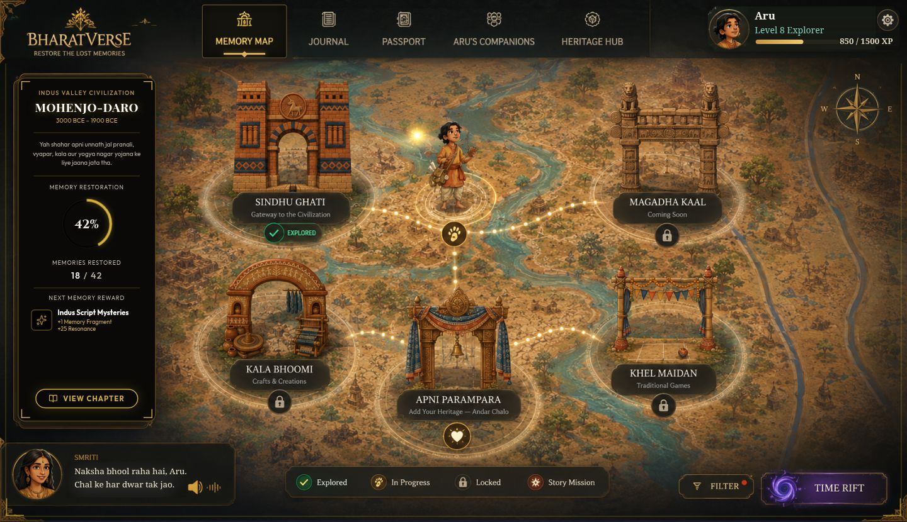
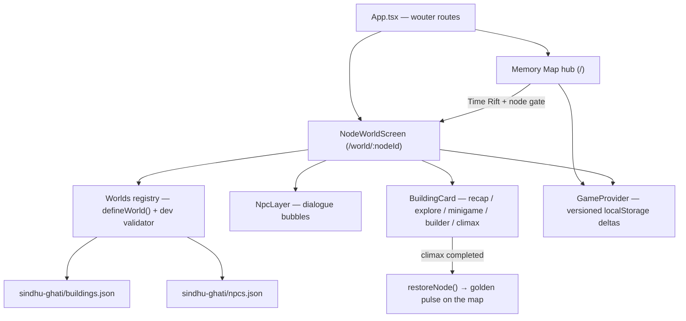

<div align="center">

# 🛕 BharatVerse — Restore the Lost Memories

**An interactive Indian-heritage exploration game for school students.**

A mysterious **Time Rift** has stolen India's memories. Travel with **Aru** — a curious student — and **Smriti**, the spirit of memory, into hand-painted historical worlds. Walk their streets, meet their people, solve their puzzles, and earn back the lost chapters of history.


> *Wonder, not lecture: every fact is discovered by walking through a living world, talking to villagers, and solving puzzles — never by reading a wall of text.*



</div>

---

## 📖 Table of Contents

- [The Story](#-the-story)
- [How the Game Works](#-how-the-game-works)
- [Screenshots](#-screenshots)
- [Feature Highlights](#-feature-highlights)
- [Architecture](#-architecture)
  - [Monorepo layout](#monorepo-layout-pnpm-workspaces)
  - [How the pieces connect](#how-the-pieces-connect)
  - [The stage system](#the-stage-system-art-first-rendering)
  - [The world engine](#the-world-engine-config-driven-worlds)
  - [The NPC engine](#the-npc-engine)
  - [Rift transitions](#rift-transitions)
  - [Progress & persistence](#progress--persistence)
- [Project Structure](#-project-structure)
- [Getting Started](#-getting-started)
- [Dev Helpers](#-dev-helpers)
- [Design Principles](#-design-principles)
- [Roadmap](#-roadmap)

---

## 🌏 The Story

India's collective memory is fading — a **Time Rift** has scattered it across the ages. Aru, an ordinary school student, discovers he can step *into* the Memory Map: a living, painted atlas of Indian civilizations. Guided by **Smriti** (memory personified), he must restore each era — the Indus Valley, Magadha, and beyond — by exploring its places, listening to its people, and proving he understands how they lived.

Every restored memory lights up the map. Restore them all, and history itself is saved.

## 🎮 How the Game Works

The game is built in **two nested layers**, both rendered as interactive paintings:

### Layer 1 — The Memory Map (hub)

The home screen is a hand-painted map with **five era nodes**. Each node shows its **Memory Restoration %**, memories found, and the next reward. A pinned chapter panel (left), Smriti's dialogue bar (bottom), a state legend, era filters, and the **Time Rift** button complete the HUD. Restoring a region fires a golden pulse across the map — visible proof that a piece of history is back.

### Layer 2 — Node worlds (the village layer)

Entering a node through the rift lands you **inside** that era: a tall painted world that you pan vertically (wheel, drag, or arrow keys). Everything in the painting is real gameplay — for the Indus Valley (Mohenjo-daro) world:

| Building | Role | Stage |
| --- | --- | --- |
| **Sheher ka Dwaar** (City Gate) | Node intro & recap | `recap` |
| **Vishaal Snanagar** (The Great Bath) | Discovery panels | `explore` |
| **Anaaj Bhandaar** (The Great Granary) | Discovery panels | `explore` |
| **Dhaki Naaliyan** (Street of Covered Drains) | Discovery panels | `explore` |
| **Bazaar** (Market street) | Discovery panels | `explore` |
| **Naali Paheli** (Drain Puzzle) | Minigame — *"Save the City"* | `minigame` |
| **Sheher Banao** (City Builder) | Builder — plan a mohalla, survive the flood | `builder` |
| **Aakhri Raaz** (House of Mysteries) | Node climax — restores the region | `climax` |

- **Free-roam with one gate.** Visit buildings in any order; only **Aakhri Raaz** stays locked until the others are done. Completing it restores the whole region on the Memory Map.
- **Living NPCs.** Villagers speak when hovered/tapped (Hindi dialogue bubbles), and ambient villagers murmur on their own in a staggered cycle — the streets feel alive without covering the art.
- **Rift transitions.** Entering/leaving a world plays a purple rift veil blooming from the exact gate you clicked; `prefers-reduced-motion` users navigate instantly instead.

## 🖼️ Screenshots

| Village entrance | The Great Granary | Bazaar street |
| --- | --- | --- |
|  |  |  |

*(Hero image above: the Memory Map hub with the Mohenjo-daro chapter pinned.)*

## ✨ Feature Highlights

- 🎨 **Pixel-faithful painted worlds** — the illustrations *are* the game board; UI is measured against them 1:1
- 🏘️ **A generic, config-driven world engine** — new eras are two JSON files + one painting, zero screen code
- 🗣️ **13 living NPCs** with hover/tap/keyboard dialogue and self-paced ambient chatter
- 🔓 **Free-roam progression** with derived building states and a single climax gate per world
- 🌀 **Cinematic rift transitions** with a cross-navigation handshake and reduced-motion fallbacks
- 💾 **Versioned, delta-only saves** in `localStorage` — content updates can never corrupt old progress
- ♿ **Accessible by default** — full keyboard paths, `role="status"` live regions, stable Hindi `aria-label`s
- 🧪 **Dev-time config validation** that fails loudly on authoring mistakes (dangling ids, out-of-bounds hotspots…)

## 🏗️ Architecture

### Monorepo layout (pnpm workspaces)

```
├── artifacts/
│   ├── bharatverse/        # The game — React + Vite web app (main artifact)
│   ├── api-server/         # Express API server (future backend features)
│   └── mockup-sandbox/     # Dev-only isolated component preview server
├── attached_assets/        # PRDs + reference paintings (design source of truth)
├── docs/screenshots/       # README imagery
└── replit.md               # Working agreements & architecture notes
```

**Stack:** React 18 + TypeScript + Vite · wouter (routing) · Tailwind CSS · TanStack Query · Express.

### How the pieces connect



### The stage system (art-first rendering)

The entire game renders on a **fixed 1024×592 logical stage** that scales uniformly to the viewport (`StageLayout`, constants in `src/lib/stage.ts`). Reference paintings are shown 1:1 in stage pixels; interactive elements are **invisible hotspots positioned in world coordinates** on top of the art. This is what keeps the game pixel-faithful to the reference illustrations — and it means a designer can point at any pixel of the painting and say "that should do something," and it can.

The village painting is 1024×1536 world-px; the screen pans vertically through it (scroll range 0–944) with wheel, drag, and keyboard, all easing through the same scroll model.

### The world engine (config-driven worlds)

`NodeWorldScreen` is a **generic template**: it receives a `nodeId` (route `/world/:nodeId`) and renders that node's world entirely from the registry. **Adding a new era world requires zero screen-code changes:**

1. Drop the world painting in `src/assets/images/` (width 1024 world-px; any height — the screen pans).
2. Create `src/game/worlds/<node-id>/buildings.json` and `npcs.json` following `world-types.ts`.
3. Add one `defineWorld({...})` entry to the registry in `src/game/worlds/index.ts`.

A building entry is pure data — position, art crop, gating, and copy:

```jsonc
{
  "id": "aakhri-raaz",
  "name": "Aakhri Raaz",
  "nameEn": "House of Mysteries",
  "position": { "x": 512, "y": 1180 },      // world-px on the painting
  "routeTarget": "climax:mystery-ending",    // namespaced stage to launch
  "initialState": "story-mission",
  "unlocksAfter": ["great-bath", "granary", "covered-drains", "bazaar", "drain-puzzle"]
}
```

A **dev-only validator** fails loudly at load if a config has mistakes — out-of-bounds coordinates, dangling `unlocksAfter` ids, duplicate ids, a missing (or second) climax, a registry key that doesn't match the config's `nodeId` — so authoring errors can never ship as silent dead hotspots.

**Building states are derived, never stored:** `completed → explored`, else `unmet unlocksAfter → locked`, else the authored initial state. Completing a world's single `climax` building fires the hub's region-restore.

### The NPC engine

Bubble visibility is **source-aware**: hover, keyboard focus, tap-pin, and the ambient auto-speak cycle each own an independent flag, and a bubble shows while *any* is active — so the ambient timer can never dismiss a bubble the player is reading. Details that matter:

- Ambient villagers speak **one at a time** (stagger > bubble open duration) — a murmur, not a chorus.
- Keyboard accessible: hotspots are focusable buttons with stable Hindi `aria-label`s; transient dialogue renders in a `role="status"` live region; `:focus-visible` gating stops mouse clicks from sticking bubbles open.
- Bubbles clamp to the canvas near edges and flip below the speaker near the top of the view, so the nav bar never covers them.

### Rift transitions

A `sessionStorage` handshake (`bv-rift-veil`: destination + expiry) coordinates the two halves of a transition across navigation — the out-veil on the screen you leave, the in-reveal on the screen you enter. Veils render through a **portal to `document.body`**: the scaled stage creates a stacking context that would otherwise trap any overlay beneath the fixed nav.

### Progress & persistence

Progress (restoration %, memories, completed buildings) persists in `localStorage` under a **versioned schema** (`SCHEMA_VERSION`), and only player *deltas* are saved — never whole config-driven objects — so content updates can't corrupt old saves. Unknown ids in an old save are ignored instead of crashing the new UI.

## 🗂️ Project Structure

```
src/ (inside artifacts/bharatverse)
├── components/
│   ├── hub/          # Memory Map: MapStage, InfoPanel, SmritiDialogue,
│   │                 #   LegendBar, RightControls, StageLayout, TopNav
│   ├── world/        # Village layer: NodeWorldScreen, NodeBuilding,
│   │                 #   BuildingCard, NpcLayer, DialogueBubble, RiftTransition
│   └── ui/           # shadcn/ui primitives
├── game/
│   ├── store.tsx     # Global state + versioned localStorage persistence
│   ├── nodes.ts      # Hub node data (eras, positions, restoration state)
│   ├── world-types.ts# WorldConfig / WorldBuilding / WorldNpc schemas
│   └── worlds/
│       ├── index.ts  # World registry + dev-time config validator + how-to guide
│       └── sindhu-ghati/
│           ├── buildings.json   # 8 buildings: type, position, gating, copy
│           └── npcs.json        # 13 NPCs: category, position, dialogue lines
├── lib/              # stage constants, reduced-motion hook, utils
└── pages/            # Hub, Journal, Passport, Companions, Heritage, …
```

## 🚀 Getting Started

Requirements: **Node 20+** and **pnpm 9+**.

```bash
git clone https://github.com/adityarajgupta154/bharatverse-game.git
cd bharatverse-game
pnpm install

# The game (Vite dev server)
pnpm --filter @workspace/bharatverse run dev

# Optional: API server & component sandbox
pnpm --filter @workspace/api-server run dev
pnpm --filter @workspace/mockup-sandbox run dev

# Typecheck everything
pnpm run typecheck

# Production build (static bundle → artifacts/bharatverse/dist/public)
pnpm --filter @workspace/bharatverse run build
```

> **Note:** in local dev outside Replit, the game's dev server expects `PORT` and `BASE_PATH` env vars (fail-fast by design), e.g. `PORT=5173 BASE_PATH=/ pnpm --filter @workspace/bharatverse run dev`. Production builds need neither.

## 🛠️ Dev Helpers

| Helper | What it does |
| --- | --- |
| `/world/sindhu-ghati?debug` | Shows hotspot outlines + NPC ids + dev-complete buttons on building cards |
| `/world/sindhu-ghati?at=472` | Opens the world pre-scrolled to world-Y 472 |

## 🧭 Design Principles

1. **Pixel-parity with the reference art.** The illustrations are the spec: UI is either baked into the painting or measured against it.
2. **Config over code.** Story content lives in JSON; engines are generic. New eras are data, not features.
3. **Explicit failure.** Config validators throw with aggregated, actionable messages in dev; saves are schema-versioned; missing env vars fail fast.
4. **Accessible by default.** Full keyboard paths, reduced-motion fallbacks for every animation, screen-reader-safe labels.

## 🗺️ Roadmap

- 🧩 **Minigames** (next up): *Naali Paheli — "Paani ko Raasta Do"* (rotate drain tiles, beat the monsoon) and *Sheher Banao — "Naya Mohalla"* (plan a settlement, survive the flood event).
- 🏛️ **Magadha** and the remaining era worlds — the engine is ready; each is one painting + two JSON files.
- 🔗 Node unlock-chain progression on the Memory Map.
- 🔊 Audio: Smriti's voice lines and village ambience.

---

<div align="center">

Built with ❤️ on [Replit](https://replit.com) · Smart India Hackathon 2026 (PS 26208)

*Reference paintings and PRDs live in `attached_assets/` — they are the design source of truth.*

</div>
